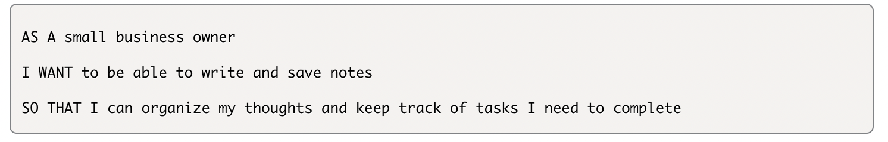
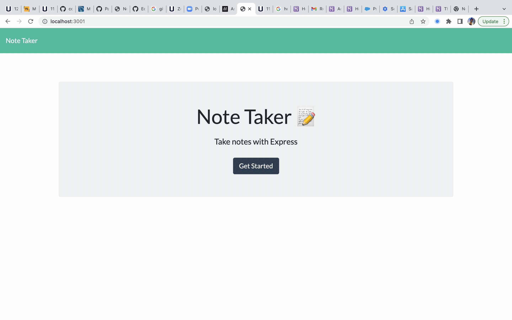
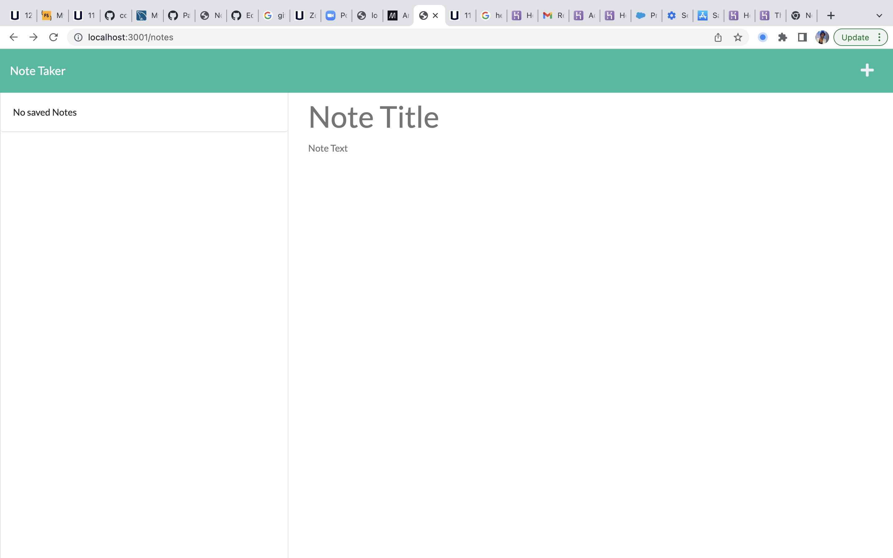
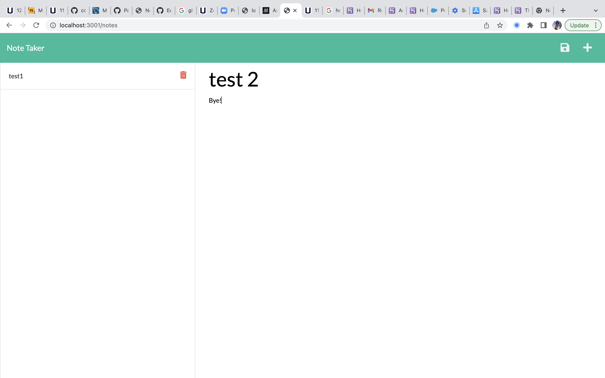
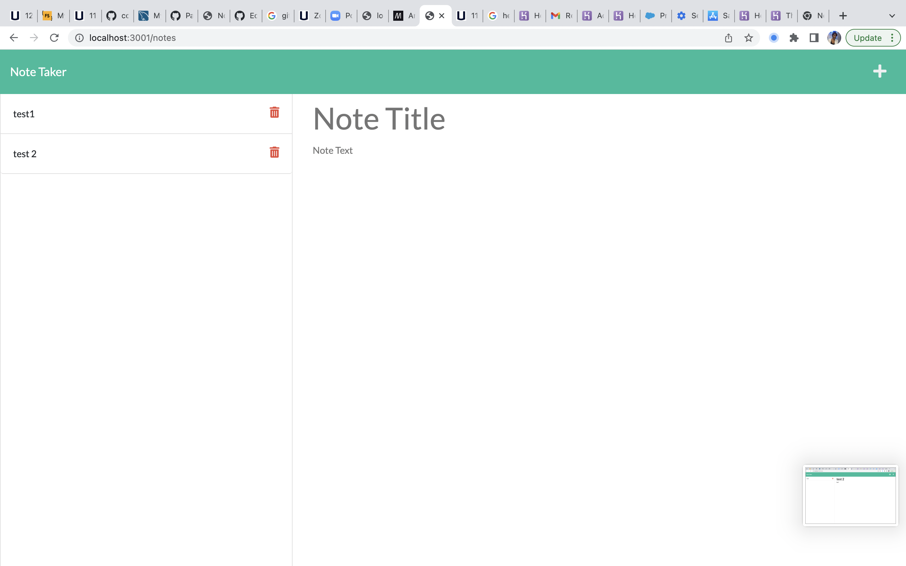

# Note-Taker

## Description

This application called Note Taker can be used to write and save notes. This application uses an Express.js back end and saves and retrieve note data from a JSON file.

## User story

## Usage

* Application will allow user to be able to add note's title and description.

* Application will allow user to be able to save the notes and won't lose them even they refresh the page.

* Application will allow user to be delete notes

## Screenshots

## Technologies Use

<a href="https://nodejs.org/">Node.js</a>

<a href="https://www.npmjs.com/">NPM</a>

<a href="https://www.npmjs.com/package/express">Express.js</a>

<a href="https://www.npmjs.com/package/inquirer">Inquirer.js</a>

<a href="https://www.npmjs.com/package/uuid">uuid</a>

<a href="https://getbootstrap.com/">Bootstrap</a>

<a href="https://fonts.google.com/">Google Fonts</a>

## Websites

*[Gihub Repository](https://github.com/aidyel/Team-Profile-Generator)

*[Heroku deployed link](https://drive.google.com/file/d/1SZXc7pSoheRPePSiVxh02e_iDObq13kb/view)